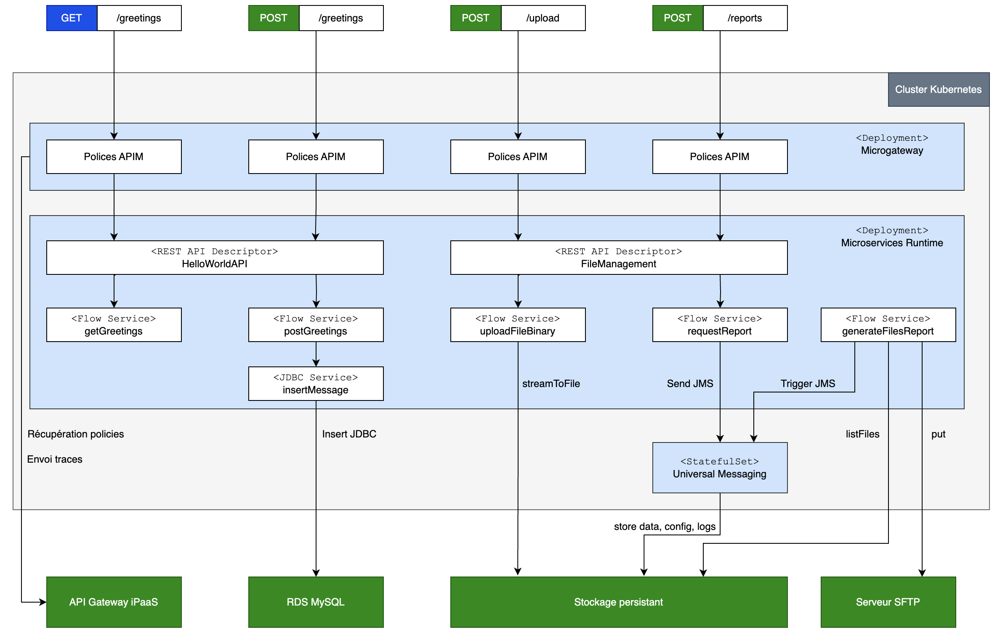

#   sttHelloWorld

This repo showcases the Microservices Runtime usage to implement various integration scenarios in a CaaS environment:
-   exposition of REST APIs (both contract first and code first)
-   integration with relation databases using the JDBC adapter
-   messaging using Universal Messaging (also deployed in the CaaS) and JMS
-   file persistence using PV and PVC
-   sending of files to a SFTP server

##  Integrations

### GET /greetings

TLDR: simple hello world API method

Simple API methods implemented in a code first approach (flow service + REST resource + REST API descriptor.)  
It takes a name QP in the request and returns a "Hello %name%" message in the response.  
```
curl ${ROOT_URL}/hello-world/greetings?name=someone
```

### POST /greetings

TLDR: feeding of a relational database using the JDBC adapter

This method takes a Greeting object in input and stores it in a MySQL database, using the JDBC adapter. In the process, it adds a uuid and a creation timestamp, which are returned in the response. 
Also implemented in a code first approach.
```
TODO
```

### POST /upload

TLDR: binary API and file persistence

This method takes a binary file in input and saves it into a persistent storage space. The file name is provided in a X-Filename HTTP header.  
Implemented in a contract-first approach (see the OpenAPI v3 specification: resources/api/FileManagement.yml)  
```
TODO
```

### POST /reports

TLDR: JMS based messaging and integration with a SFTP server

This method takes a folder path in input and sends a JMS message to a queue to request the generation of a report for the files located in this folder.  
The report is generated by a JMS triggered flow service, which places the content (XML document) into a file that is sent to a SFTP server  

##  Logical architecture



We follow a classical (APIM + Integration + Data persistence) architecture.  

Instead of exposing the APIs directly through the good old (and a bit chubby) gateway, we use lightweight microgateways which can easily scale in and out. These microgateways connect to the gateway upon startup to fetch their configuration (the APIM policies), and as their process API requests they send telemetry information to the gateway (they could also directly populate an Elastic Search cluster.)  

The integration tiers is implemented using the Microservices Runtime.  

For messaging we use Universal Messaging and JMS. The UM protocol could also be used, but I have opted for the vendor agnostic JMS instead.  

In the persistence tiers, we have:
-   a RDS based MySQL, accessed using the JDBC adapter
-   a file storage space, which can be a S3 bucket, a NFS share, etc.  

The important thing is to externalize these persistence aspects outside the Kubernetes cluster. From the containers standpoint, they are external services.

##  Kubernetes deployment architecture

##  Configuration

### Microgateway configuration

TODO

### Microservices Runtime configuration

The following objects are used to configure the MSR
-   stt-hello-world (config map) stores the application.properties file
-   msr-secrets (secret) stores credentials
-   microservicesruntime-license-key (config map) stores the MSR license

stt-hello-world is provided in the Helm values.yaml file (section microservicesruntime.propertiesFile), it contains no confidential information and can be safely placed in version control.  
The two other objects are not part of the Helm release, they are provided separately. A example yaml file is provided here: kubernetes-secrets.yml.example  

### Universal Messaging configuration

Universal Messaging only needs a universalmessaging-license-key, which is provided in the form of a config map.  
Like the MSR license, it is not part of the Helm release and needs to be provided separately. A example yaml file is provided here: kubernetes-secrets.yml.example  

Note: the JMS connection factory and destination are created dynamically by the MSR thanks to the jndi_automaticallyCreateUMAdminObjects setting defined in the application.properties file.

##  Installation

