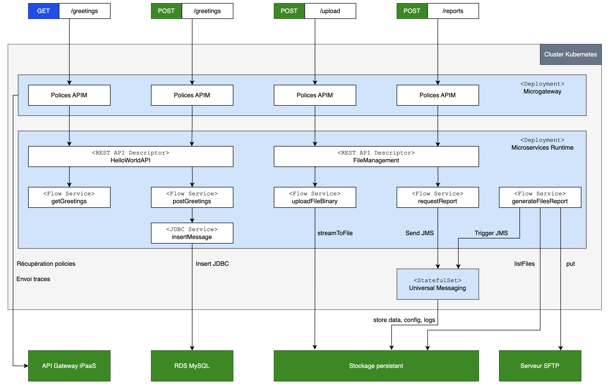

#   Architecture

##  Logical architecture

We follow a classical (APIM + Integration + Data persistence) architecture.  

Instead of exposing the APIs directly through the good old (and a bit chubby) gateway, we use lightweight microgateways which can easily scale in and out. These microgateways connect to the gateway upon startup to fetch their configuration (the APIM policies), and as their process API requests they send telemetry information to the gateway (they could also directly populate an Elastic Search cluster.)  

The integration tiers is implemented using the Microservices Runtime.  

For messaging we use Universal Messaging and JMS. The UM protocol could also be used, but I have opted for the vendor agnostic JMS instead.  

In the persistence tiers, we have:
-   a RDS based MySQL, accessed using the JDBC adapter
-   a file storage space, which can be a S3 bucket, a NFS share, etc.  

The important thing is to externalize these persistence aspects outside the Kubernetes cluster. From the containers standpoint, they are external services.

##  Kubernetes deployment architecture

### Microservice runtime

### Universal Messaging

