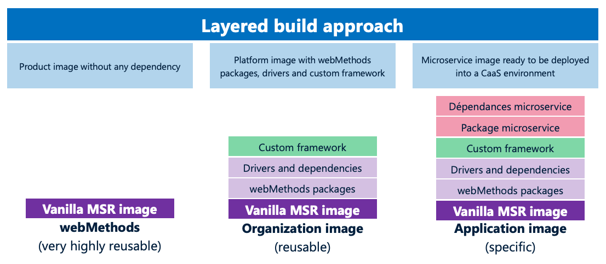

#   Microservice image build

Note: for UM and Microgateway, the vanilla images provided via containers.webmethods.io can be used.

The MSR base image provided via https://containers.webmethods.io is a minimal image that contains very few packages. This is by design as this image can be extended using packages located in https://packages.webmethods.io, for instance the JDBC adapter or CloudStreams connectors.  
To draw a parallel, this is very much like with Node.js: you can a minimal platform with the core of the runtime, and you can then extend it using a package manager that fetches dependencies in various places. https://packages.webmethods.io is the requivalent of https://www.npmjs.com and the webMethods package manager (wpm) is similar to npm or yarm (although npm and yarm provide a wider scope of features.)  

We could directly build our target microservice image using the product base image, but the best practice is to follow a layered approach:
1. We build a reusable organization image that contains all the development dependencies needed by the development teams
2. We use this base image to build our microservice image

Part 1 usually is managed by a central team, who takes care of governance aspects (security, compliance, alignment with standards, ...)  
Part 2 is managed by the team in charge of developing the microservice. 



##  Build of the organization image

The combination of https://containers.webmethods.io + https://packages.webmethods.io + wpm should be used unless there is a good reason to do differently.  

In our case, we need a feature that's not yet provided by https://packages.webmethods.io: WmMonitor. It provides the webMethods monitoring features as well as the ability to replay integrations in error.  
The alternative way is to use the good old webMethods installer, according to these instructions: https://documentation.softwareag.com/a_installer_and_update_manager/wir10-15/webhelp/wir-webhelp/#page/wir-webhelp%2Fto-console_mode_27.html%23  

The process needs to be conducted inside a x64_86 linux server where a docker runtime is installed.  
In what follows, installer.bin is the renamed webMethods installer (Linux x64_86 version.)  

First, generate a raw product image using:
```
sh installer.bin create container-image --name wm-msr:10.15 --release 10.15 --accept-license --products MSC,Monitor,jdbcAdapter --admin-password manage --username $EMPOWER_USERNAME --password $EMPOWER_PASSWORD
```
It should take a few minutes.  
At the end of the process, check the docker image using `docker images`, which should return:
```
REPOSITORY                                    TAG             IMAGE ID       CREATED       SIZE
wm-msr                                        10.15           91b384a7c455   2 days ago    1.44GB
```

Then, this image needs to be optimized and enhanced:
-   removal and un-needed files and folders
-   addition of the MySQL JDBC driver
-   transfer of the resulting installation to an empty ubi base image (this is what we call a staged build, the purpose being to optimize the layers and reduce the image size)
-   install of a few utilities  

For this a [Dockerfile](../build-base-image/Dockerfile) is provided. Build the organization base image using:
```
docker build -t <your-image-name> .
```
(This assumes you're executing the build command in the folder where the Dockerfile is located.)  
Then you can push this image to a container registry and use it for the subsequent microservice builds.  

Note: this base image build process can be automated using a CI pipeline.  

##  Build of the microservice image

Once we've got the organization base image, building the microservice image is very simple.  
In this Hello World project we've got one integration package, so we can just copy the repo content into the container image.  
See the [Dockerfile](../../Dockerfile) file that is at the root of the repository, which uses an organization image I have previously built and pushed to Docker Hub.  
To keep the container image clean, a list of excluded files and folder has been specified in the [.dockerignore](../../dockerignore) file.  
```
docker build -t <your-image-name> .
```

If the microservice needs to embed multiple integration image, another approach is to use wpm to install the packages during the build, and make it point to the Git remote projects where the integration packages are located.  